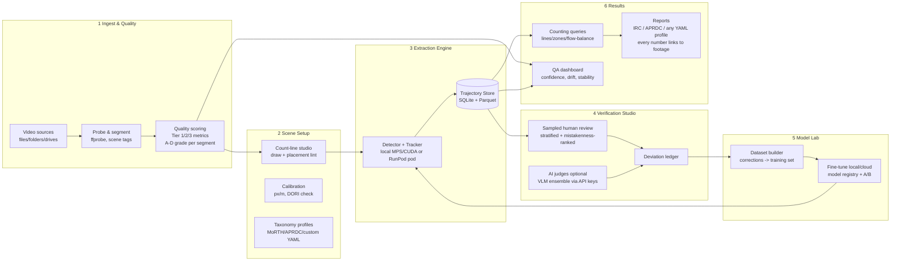

# TrafficLens — Standalone Traffic Survey Application
## Architecture Design Document (v1.0, Aug 2026)

Based on: our working pipeline (5 videos → fine-tuned 15-class model → IRC/APRDC workbooks), plus deep research into (1) app tech stacks used by shipping CV products, (2) human-in-the-loop workflow patterns from CVAT/Label Studio/Roboflow/FiftyOne/Encord/GoodVision/DataFromSky/Miovision, (3) footage quality & no-ground-truth confidence literature.

---

## 1. Product principles (from the user's requirements)

1. **Complete workflow in one app**: data source → breakdown → verify/validate → optional AI verification → fine-tune on deviations → full run → reports.
2. **Not a black box**: every stage inspectable and adjustable; every reported number traceable to footage.
3. **Quality-aware**: the app measures footage quality (angle, night/day, blur, compression) and *tells the user what accuracy to expect and why* before burning compute.
4. **Count-line placement is a first-class citizen**: assisted drawing, placement warnings, and free re-drawing without re-processing.
5. **Human effort is precious**: sampling + AI judges shrink review work; the human is the final authority.
6. **Cloud optional**: runs fully local (Apple Silicon/NVIDIA); adding cloud GPU credentials (RunPod) or VLM API keys (OpenRouter/Anthropic) unlocks faster/verified modes.

## 2. The keystone decision: Trajectory Store

**Extract once, query forever** (the GoodVision/DataFromSky pattern, validated by our own pain: every line adjustment cost us a re-run).

The heavy step (detection + tracking) runs ONCE per video and stores **trajectories** (track id, class votes per frame, bbox path, confidences). Count lines, zones, direction gates, taxonomy mappings, and reports are all **queries over stored trajectories** — redraw a line, get new counts in milliseconds. Corrections (reclassify a track, delete a phantom) edit the trajectory record, and every downstream number updates.

This single decision delivers: adjustable count lines (requirement #4), cross-checking (#2), cheap human verification (#5), and instant re-reporting for any taxonomy.

## 3. System overview

## 4. Module specifications

### 4.1 Ingest & Data Quality  *(answers "insights on data quality")*
- Sources: files, folders, external drives (auto-scan for DVR naming patterns like `chNN_YYYYMMDDHHMMSS`), later RTSP.
- Segmenting: fixed 5–15 min segments; wall-clock aligned bins from filename/OCR timestamp.
- **Three-tier quality scoring** (from research, per segment):
  - **Tier 1 (CPU-cheap, pre-count gate):** Laplacian-variance blur (road ROI, vs site baseline), exposure clipping fractions, RMS contrast, Immerkær noise sigma, blockiness ratio + stream QP/bitrate, glare fraction (saturated-blob analysis), day/night/dusk (luma + solar elevation cross-check — disagreement itself flags blocked camera/wrong clock), tamper checks (camera moved/blocked/defocused vs reference background).
  - **Tier 2 (during a 60–120s probe run):** median bbox height of smallest class at the count line (gate: ≥30–40 px for 2W classification; DORI ≥25 px/m detection, ≥62.5 px/m classification), occlusion proxy (pairwise-IoU rate), foreshortening ratio near/far, track fragmentation & traversal ratios.
  - **Tier 3 (sampled, heavier):** DOVER-Mobile technical score, PCR pre/post-NMS mAP proxy, stride-2 recount stability, optional second-detector agreement.
- Output: **A–D confidence grade per segment with named reasons** ("Grade C: night + glare 3.1% + 2W median 22px at line — expect classification errors; consider moving line nearer") — shown BEFORE the user spends GPU time.

### 4.2 Scene Setup
- **Count-line studio** (evolves our draw.html): draw lines/zones/direction-gates on live video preview; multiple lines per scene; named approaches.
- **Placement lint** (research-backed warnings): line near frame edge; line in far-field (median object < 30px); line crossing queue/stop area (detected via probe-run dwell); high-occlusion region; suggests a paired validation line downstream and direction-gate pairs.
- Auto-calibration: vanishing-point px/m estimate → DORI numbers per line.
- Taxonomy manager: our YAML profiles (MoRTH-15 default, APRDC-18, custom builder UI); attribute sub-splits (taxi/APSRTC livery) declared here.

### 4.3 Extraction Engine
- Detector: our fine-tuned YOLO (ONNX runtime in shipped builds; torch for training); pluggable model registry.
- Tracker: ByteTrack/OC-SORT; per-frame class votes stored (majority vote computed at query time → corrections can re-vote).
- Runs local (MPS/CUDA) or cloud: with RunPod credentials, the app creates a pod (our proven deploy/terminate chains, hardened: heartbeats, max-runtime auto-kill, verified termination), ships segments, pulls trajectory Parquet back incrementally.
- Checkpoint-resumable: `(video, last_frame, tracker warmup window)` — survives crashes/preemption.

### 4.4 Verification Studio  *(answers "verify and validate by human with sample and random judgment")*
- **What humans see**: clip player with trajectory overlays (DataFromSky pattern) — approve/fix at the *track* level (reclass track, delete track, split merged track), which is far faster than box-level.
- **Sampling engine**: stratified (site × approach × time-band × class) acceptance sampling; 100% review for a new site decaying to 5–15%; sequential testing to stop early on clearly-good lots; target expressed in domain units: **±5 vehicles per class per 15-min bin** (Miovision standard, compatible with IRC ±5%).
- **Ranked queues, not random-only**: mistakenness ranking (FiftyOne pattern — judge/model disagreement first), flow-balance violations, count-vs-profile anomalies. Random sample on top as honest control.
- **Honeypots**: gold clips inserted into review queues to calibrate reviewers (CVAT pattern); immediate feedback on submit.
- **AI judges (optional, credentials-gated)**: our 3-judge VLM ensemble (crop + full-frame context, blind) as a pre-filter — agreement auto-confirms, disagreement feeds the human queue. Judge calibrated against a 30–50 clip human gold set; must hit ≥80% agreement before being trusted (we measured: crop-only judging maxes ~60% exact — context images and ensembles are mandatory).
- All outcomes land in the **Deviation Ledger**: every correction with who/what/when — the training fuel and the audit trail.

### 4.5 Model Lab  *(answers "adjust or fine tune models on deviation")*
- **Retrain trigger, product-legible**: a stratum fails acceptance → its corrected data becomes the fine-tune set → retrain → auto re-run only the failed lots. Also drift sentinels (camera moved, day/night mix shift, uncertain-prediction rate) can recommend retraining.
- Dataset builder: applies deviation ledger to trajectory labels; class folding rules (e.g., our Cycle_Rickshaw→Others ruling) are config, not code.
- Training: local (small) or one-click RunPod (our chain); model registry with per-class metrics, A/B compare on a fixed validation set, one-click rollback. Nothing auto-deploys without user approval.

### 4.6 Counting, QA & Reports
- Counting = queries over trajectories: line crossings (bottom-center anchor, hysteresis), zone entries/exits, movement matrices (entry-zone→exit-zone).
- **Cross-checks (free, always-on)**: paired-line agreement, junction flow conservation (in ≈ out), stride-2 stability index, hour-of-day z-score vs the site's own learned profile (after 2+ days).
- **Defensibility view** (GoodVision pattern): click any cell in any report → the exact footage interval plays with the counted vehicles listed and highlighted. This is the anti-black-box feature.
- Reports: our IRC 5-sheet generator + taxonomy profiles (APRDC etc.), PCU conversion, peak-hour, direction-wise, 15-min bins; exports Excel/CSV/Parquet; every workbook embeds the QA grade sheet (segment grades, sampling results, deviation rates) — the accuracy certificate.

## 5. Tech stack (research-validated)

| Layer | Choice | Why |
|---|---|---|
| Backend | **FastAPI + uvicorn**, one process | The pattern of FiftyOne/Label Studio/Frigate/ComfyUI; evolves our serve.py |
| Frontend | **React SPA** (video player + canvas overlays + charts), served at localhost | Frame-accurate overlay UIs are web-native; our 3 review tools port directly |
| DB | **SQLite (WAL)** system of record; **Parquet per video + DuckDB** for trajectory/event analytics | Label Studio-proven at this scale; DuckDB makes 15-min-bin aggregations instant |
| Jobs | `jobs` table + **one worker process** (Huey/SQLite if needed), SSE progress, frame-level checkpoints | One GPU = one worker; debuggable; no Redis/Celery |
| Local inference | **ONNX Runtime** in shipped builds (X-AnyLabeling trick, saves ~2 GB); torch only for training | Dodges the #1 packaging failure mode |
| Cloud | RunPod via official SDK (pods + our volume), OpenRouter/Anthropic keys for judges | Already proven in this project; keys stored in OS keychain |
| Shell (Phase 2) | **Tauri v2** (or Electron if video-render quirks bite) + **uv first-run env install** | ComfyUI Desktop/Transformer Lab pattern; never PyInstaller-freeze torch |
| Updates/weights | Lockfile-driven env updates; hash-pinned weight downloads (R2/HF), offline import fallback | |

## 6. Data model (core tables)

- `projects`, `sites` (camera, reference frame, learned hourly profile), `videos` (source, clock offset, probe stats), `segments` (time range, quality metrics JSON, grade, condition tags)
- `scenes` (per site: lines, zones, gates, calibration, lint results, versioned)
- `tracks` (id, video, class_votes, t_start/t_end, confidence stats) + `track_points` in Parquet
- `events` (derived: crossings — recomputed on line edit; materialized per report)
- `reviews` (sample plans, verdicts, honeypot scores), `deviations` (ledger), `judgments` (VLM)
- `models` (registry: weights hash, training set snapshot, per-class metrics), `jobs`, `taxonomies`

## 7. Reuse map — what we already have

| Existing asset | Becomes |
|---|---|
| run_benchmark.py (detector+tracker+LineZone) | Extraction Engine core (refactor: emit trajectories, not just crossings) |
| draw.html + lines JSON | Count-line studio v0 |
| boxes.html / verify.html / review.html | Verification Studio v0 (track-level UI to be added) |
| vlm_judge.py (3-judge ensemble, context mode) | AI-judge service |
| RunPod deploy/train/terminate chains + volume | Cloud runner (harden: heartbeat, auto-kill) |
| build_dataset.py + resolution/verdict merge | Dataset builder |
| generate_irc_report.py + taxonomy YAMLs | Report engine |
| serve.py | Grows into the FastAPI backend |
| yolo26s_morth15_v2.pt (+ registry on volume) | First registered model |

## 8. Phased build plan

- **Phase 0 — Consolidate (≈1 week):** restructure current scripts into one Python package with the SQLite schema; trajectory-store refactor of the engine (biggest single change); keep current HTML tools working against it.
- **Phase 1 — Core app (≈3–4 weeks):** FastAPI + React shell; project/site/video management; ingest with Tier-1 quality + day/night tagging; count-line studio with lint; extraction jobs with progress; counting queries; IRC/APRDC reports with defensibility view (number → footage).
- **Phase 2 — Verification Studio + QA (≈3 weeks):** track-level review player; stratified sampling engine + acceptance decisions; honeypots; deviation ledger; QA dashboard (grades, drift sentinels, stability, flow balance); AI judges behind credential settings.
- **Phase 3 — Model Lab + Cloud (≈2–3 weeks):** dataset builder from deviations; RunPod training/inference integration with hardened lifecycle; model registry/A-B/rollback.
- **Phase 4 — Package & polish (≈2 weeks):** Tauri shell, uv bootstrap installer, ONNX inference path, signed builds (Apple $99/yr; Windows via Azure Trusted Signing), weight distribution.

Total: ~10–13 weeks of focused solo effort to a distributable v1 — with usable value from Phase 1 onward (the current workflow, integrated).

## 9. Risks & open questions

1. **Trajectory-store refactor** touches the engine core — do it first (Phase 0) while the system is small.
2. **Track-level review UX** is the hardest new UI (smooth scrubbing + overlays); mitigate by starting from the DataFromSky interaction model and our existing player code.
3. **Quality-metric calibration**: thresholds are literature starting points; each must be calibrated per site against the manual samples the workflow produces anyway.
4. **Judge economics**: VLM judging cost scales with traffic density; the sampling engine must gate it (judge the sample + the flagged, not everything).
5. **Windows/NVIDIA testing** once packaging starts — all current work is macOS/cloud.
6. Attribute sub-splits (taxi/APSRTC) remain a Phase 3+ add-on: per-track single-crop classification, cheap, no retraining.

---

# v1.1 Amendments (post-review, Aug 2026)

## Decisions taken
1. **Detector licence**: migrate off Ultralytics (AGPL) to an Apache-2.0 detector. Candidate order: RF-DETR, then D-FINE. Ultralytics v2 model remains internal-only (benchmark/dev). Licence sweep extended to every shipped dependency AND to pretrained *checkpoint* licences separately from repo licences (backbone weights frequently differ). DOVER (research licence) removed from shipped Tier-3.
2. **Accuracy basis = cluster sampling over bins**: 3–4 exhaustively-reviewed 15-min bins per camera-day, stratified across peak/off-peak/night, reviewed with trajectory overlays. Yields per-bin, per-class count error in report units for ~1 hour of human time per camera-day.
3. **Footage: proxy clips at ingest** (720p ~800 kbps); originals = external archive with path + content hash recorded in the workbook QA sheet. All review UIs and the defensibility view run on proxies. PII blur hooks into the proxy/export pipeline.

## Why the two review queues must never merge (prose, on purpose)
The app maintains two human-review queues with different statistical characters. The **accuracy queue** (cluster-sampled whole bins) exists to *estimate error*: its sample is chosen by a rule that is independent of model behaviour, so its deviation rate is an unbiased estimate of the deviation rate everywhere, and it is the only number allowed to feed the accuracy claim on a report. The **improvement queue** (mistakenness-ranked tracks, judge disagreements, flow-balance flags) exists to *find errors*: it deliberately over-samples the cases the model finds hard. Corrections from it are excellent training data and terrible statistics — folding them into the accuracy estimate biases the claim in an unauditable direction (it can make accuracy look worse — you reviewed the hardest cases — or better — you fixed exactly what you measured). Six months from now it will be tempting to count improvement-queue reviews toward the accuracy number "because they're already reviewed." Do not. The queues share a UI; they never share statistics.

## Design corrections adopted
- **Acceptance band**: max(±5 vehicles, ±5%) per class per 15-min bin; classes under ~20/bin judged on daily aggregates instead.
- **Flow conservation**: per-site opt-in; tolerance learned from the site's first 2 days; surfaced as "unbalanced flow — check mid-block access", never as an error.
- **Quality gate**: replace DORI with the model's own empirical per-class F1-vs-bbox-height curve (baseline from v2 validation predictions; regenerated per registered model). DORI kept only as a pre-model fallback for new cameras, labeled as rough.
- **Counting anchor**: per-scene configurable (bottom-centre / centroid / smoothed foot point); hysteresis scaled by calibrated px/m; anchor+params recorded per event via scene_version. Trajectory store enables zero-cost anchor A/B.
- **Human corrections**: stored as class_override, separate from class_votes. Override wins at query time; votes preserved intact as training signal.
- **Provenance**: tracks carry model_id + scene_version; reports pin both; mixed-version workbooks require explicit user acknowledgement printed on the QA sheet.
- **Seam handling**: checkpoint resume stitches tracks across the seam (IoU+class matching over a warmup overlap); query-time duplicate guard as backstop; dedicated invariance test (split-at-midpoint vs full run must produce identical counts) built against v2 BEFORE detector migration, kept green thereafter.
- **macOS inference**: ORT-CoreML benchmarked against torch-MPS with pre-committed rule (ship torch on macOS if ORT < 0.8× MPS throughput); ONNX Runtime remains the Windows/CUDA path.
- **PII/DPDP (Phase 1)**: export-time plate/face blur, per-project retention policy with actual deletion, per-project access control, data-handling statement on every workbook QA sheet.

## Migration acceptance rule (pre-committed before any retrain)
RF-DETR replaces v2 **only if**, on the identical validation split:
1. Per-class F1 in the 2W-critical height band (the 20–40 px buckets) ≥ v2's, AND
2. Every major class (2W, 3W_Auto, Car, Bus, LCV, truck family) per-class F1 within −0.03 of v2 overall.
Otherwise D-FINE is trained and judged by the same rule. Aggregate mAP is explicitly NOT the acceptance metric (it hides small-object class failure). Additional pre-training checks: backbone checkpoint licence verified & recorded; num_queries raised if densest validation frame exceeds ~50% of query budget; ByteTrack high/low thresholds re-tuned against replayed trajectory segments (NMS-free confidence distributions differ), acceptance = crossing-diff review on identical segments.

## Plan deltas
Phase 0 = 2 weeks, now owns: height-vs-F1 baseline curve → detector migration w/ pre-committed rule → licence sweep (incl. checkpoints) → YOLO↔COCO converter with round-trip test (checked in, reused for D-FINE) → seam-stitching + invariance test (green on v2 pre-migration) → ORT-CoreML benchmark → provenance columns → proxy-pipeline decision implemented at ingest design. Phase 2 = 5 weeks. Total ≈ 13–16 weeks.
